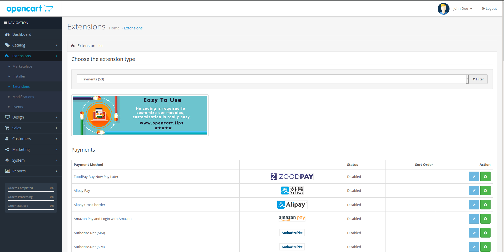
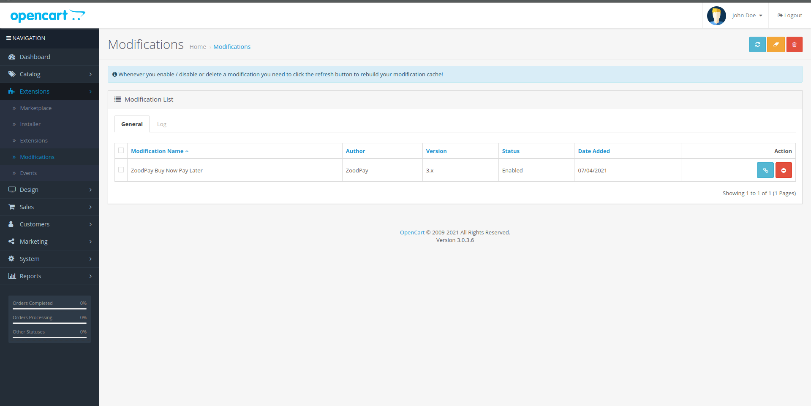

# ZoodPay OpenCart 3.X Payment Gateway
[](LICENSE.md)

ZoodPay Buy Now Pay Later Payment Gateway for the OpenCart 3.X.

[ZoodPay API Documentation](https://apidocs.zoodpay.com/)

## Installation

```
1. Log in to your website’s Opencart admin.   Ex: your-website.com/admin
2. In the left sidebar, click Extensions > Installer > Upload.
3. Locate the Zip file that you downloaded.
4. It will install the ZoodPay Extension.
5. Navigate to Extension > Payments > Find ZoodPay Buy Now Pay Later OC Activate ZoodPay

```

## Usage

```
1. Select Install 
2. Select Edit ZoodPay Buy Now Pay Later. 
3. Select the Enable for enabling ZoodPay.
4. Set Merchant Key as received from the ZoodPay Business Team.
5. Set Merchant Secret Key as received from the ZoodPay Business Team.
6. Set Merchant Salt Key as received from the ZoodPay Business Team.
7. Set API URL as received from the ZoodPay Business Team.
8. Click on the API HealthCheck, to verify the API HEALTH 
9. Select Order Statuses from the tab
10. For Each Status, Select respective Status from your System
11. Click Save Changes
12. Click Fetch Configuration
```

```
13. Navigate to Extensions > Modifications
14. Click Clear Modification
15. Click Refresh Modification

```



## Changelog
Please see [CHANGELOG](CHANGELOG.md) for more information what has changed recently.

## Contributing
Please see [CONTRIBUTING](CONTRIBUTING.md) for details.

##Support 
For any inquiry write to integration@zoodpay.com with a detailed description of the issue.
## Credits
- [ZoodPay](https://github.com/orientswiss)
## License
The MIT License (MIT). Please see [License File](LICENSE.md) for more information.
